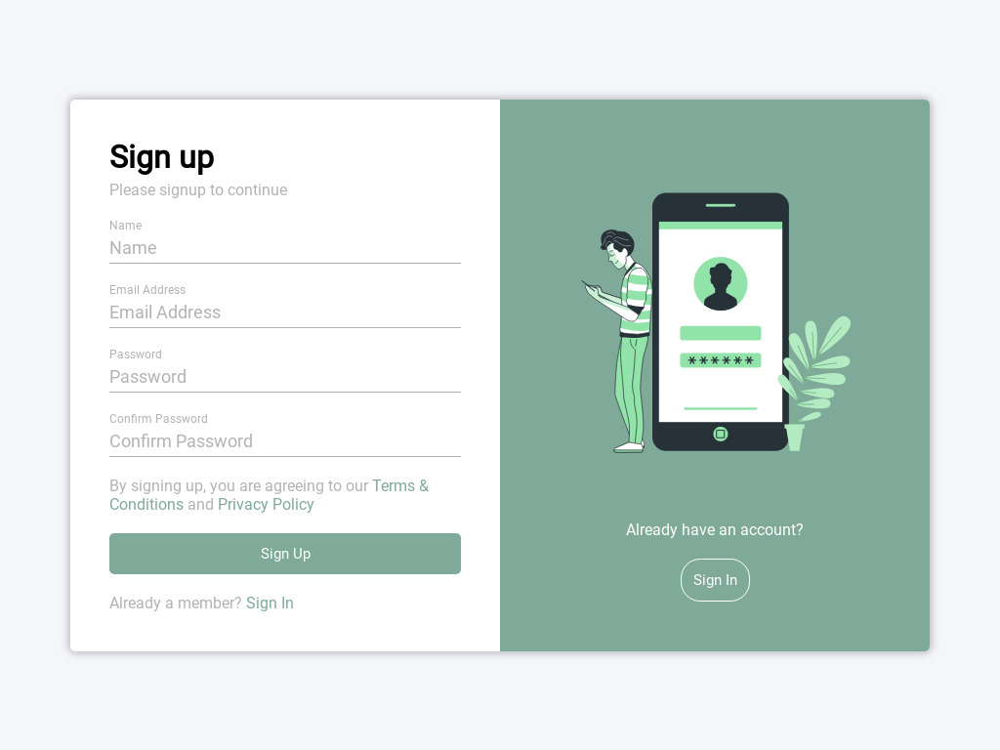
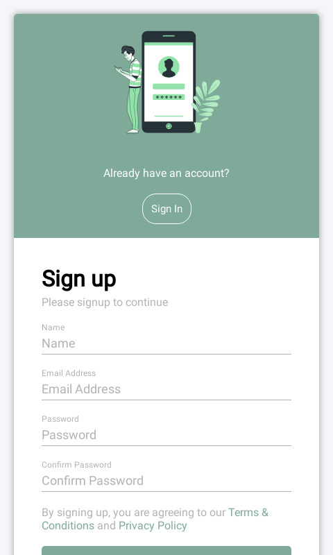

# Sign-up form
### About the project
This project is for front-end learning process. Sign-up form is a mobile friendly with modern layout and has form validation using Vanilla JavaScript, each input will show relevant error message.

Desktop screenshot

  <ol>
    
  </ol>

  
Mobile screenshot

  <ol>
    
  </ol>

### [Live preview](https://liudasbo.github.io/sign-up-form/)

---
### Built With
* HTML
* CSS
* JavaScript
---
### Resources
* Illustrative was provided by [Storyset](https://storyset.com/)